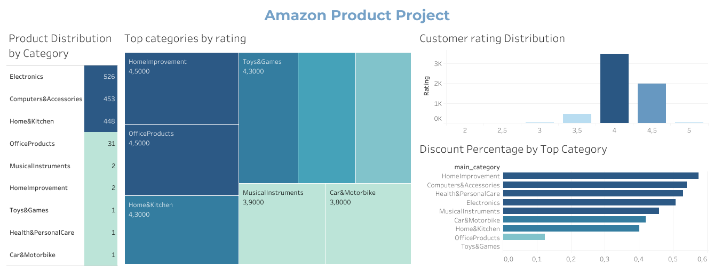

# 💰📈 ANÁLISIS DE VENTAS EN AMAZON Y SISTEMA DE RECOMENDACIÓN

## 📌 Objetivo:
Analizar productos de Amazon utilizando datos de calificaciones, reseñas y descuentos.
A partir de este análisis, se desarrolló un sistema de recomendación personalizado que sugiere productos según los intereses y comportamientos de compra de los usuarios.

## 👉🏽 Metodología:
- Carga, exploración y limpieza de datos.
- Análisis exploratorio de variables relevantes.
- Visualización de resultados mediante gráficos.
- Desarrollo de un sistema de recomendación básico.

## 📊 Resultados del análisis:

- Las categorías más populares son Electronics, Computers&Accessories y Home&Kitchen.
- Toys&Games presenta un 0% de descuento, lo que sugiere alta demanda sin necesidad de incentivos.
HomeImprovement tiene el mayor descuento (57.5%), indicando sensibilidad al precio y la necesidad de estrategias competitivas para atraer clientes.
- La mayoría de las valoraciones de clientes se ubican entre 3-4 y 4-5, con más de 1.400 reseñas positivas.
- Las categorías OfficeProducts, Toys&Games y HomeImprovement destacan con calificaciones superiores a 4.3, reflejando alta satisfacción del cliente.
- El sistema de recomendación genera una lista de recomendaciones personalizadas a un usuario específico, donde sugiere productos de calificaciones altas, optimizando su experiencia de compra.

## ✅ Conclusión:
Estos resultados permiten optimizar estrategias de venta, enfocándose en:
- Gestionar inventarios de categorías populares.
- Ajustar descuentos en segmentos sensibles al precio.
- Monitorear la satisfacción del cliente mediante reseñas y valoraciones.

## 🔗 Recursos
[ Amazon Sales Dataset](https://www.kaggle.com/datasets/karkavelrajaj/amazon-sales-dataset)
